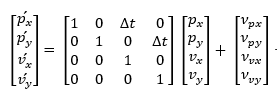
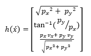
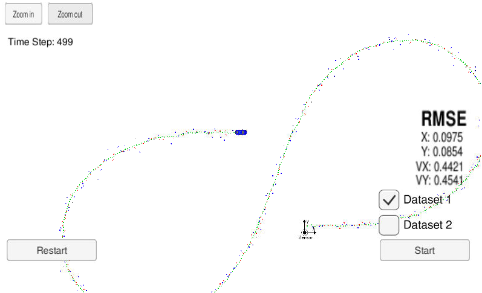

# **Sensor Data Fusion (Extended Kalman Filter)** 

## Project goal

Implementation of Extended Kalman Filter state estimator for a moving vehicle. Sensor Fusion is utilizing a combination of noisy Lidar and Radar measurements, while reducing the resulting error as much as possible using the EKF algorithm. Ordinary KF is extended to EKF algorithm to handle the non-linearities in the Radar measurement.

## Project steps

1. Process motion model: The motion model describes the motion (or the change) of the system’s state over one time sample. Constant velocity motion model is chosen.

2. Measurement model: The measurement model performs the mapping between the measured values from sensors and estimated states of the system. Non-linear measurement function h(x ́) is a conversion between cartesian and polar coordinates of Radar.
 

3. State estimation algorithm (KF and EKF): The prediction step is done using the Predict method `KalmanFilter::Predict()` of the `class KalmanFilter` . Lidar is using the KF update equations for the update step  `KalmanFilter::Update(const VectorXd &z)`, while Radar is using the EKF update equations `KalmanFilter::UpdateEKF(const VectorXd &z)`.

4. Algorithm performance evaluation: The root-mean-squared errors (RMSE) metric is used to evaluate the KF/EKF algorithm. The algorithm is tested using two different datasets each is consisting of around 500 samples (Lidar and Radar measuremetns) where the car drives down a figure 8 shaped track. 

    |State|1st Dataset RMSE|2nd Dataset RMSE|
    |-----------|--------|--------|
    |px | 0.0975   |  0.0726  |
    |py | 0.0854 |  0.0967  |
    | vx | 0.4421   |  0.4441 |
    | vy | 0.4541 |  0.4728  |

A zoomed out view in the simulator of the  first dataset

## Reflection

A comparison between fused and individual sensor data for the second dataset:
|State|Fused |Lidar only|Radar only|
|-----------|--------|--------|--------|
|px |  0.0726  | 0.1170  |0.2690  |
|py | 0.0967  | 0.1257  |0.3843  |
| vx | 0.4441 |0.6458  |0.6608  |
| vy |  0.4728  |0.5619 |0.8650  |

Using a sensor fusion algorithm would result in a better estimation quality compared to any sensor individually. The Lidar can capture good estimation of coordinates _p_x_ and _p_y_ while Radar estimation is not good because of poor coordinates estimation quality which affects the rest of states estimation.

## Other Important Dependencies

* cmake >= 3.5
  * All OSes: [click here for installation instructions](https://cmake.org/install/)
* make >= 4.1 (Linux, Mac), 3.81 (Windows)
  * Linux: make is installed by default on most Linux distros
  * Mac: [install Xcode command line tools to get make](https://developer.apple.com/xcode/features/)
  * Windows: [Click here for installation instructions](http://gnuwin32.sourceforge.net/packages/make.htm)
* gcc/g++ >= 5.4
  * Linux: gcc / g++ is installed by default on most Linux distros
  * Mac: same deal as make - [install Xcode command line tools](https://developer.apple.com/xcode/features/)
  * Windows: recommend using [MinGW](http://www.mingw.org/)

### Basic Build Instructions

* Download Udacity Simulator  [here](https://github.com/udacity/self-driving-car-sim/releases).
* This repository includes two files that can be used to set up and install [uWebSocketIO](https://github.com/uWebSockets/uWebSockets) for either Linux or Mac systems. For windows you can use either Docker, VMware, or even [Windows 10 Bash on Ubuntu](https://www.howtogeek.com/249966/how-to-install-and-use-the-linux-bash-shell-on-windows-10/) to install uWebSocketIO. Once the install for uWebSocketIO is complete, the main program can be built and run by doing the following from the project top directory.
1. Clone this repo.
2. Make a build directory: `mkdir build && cd build`
3. Compile: `cmake .. && make` 
   * On windows, you may need to run: `cmake .. -G "Unix Makefiles" && make`
4. Run it: `./ExtendedKF `

**INPUT**: values provided by the simulator to the c++ program

["sensor_measurement"] => the measurement that the simulator observed (either lidar or radar)

**OUTPUT**: values provided by the c++ program to the simulator

["estimate_x"] <= kalman filter estimated position x

["estimate_y"] <= kalman filter estimated position y

["rmse_x"]

["rmse_y"]

["rmse_vx"]

["rmse_vy"]
